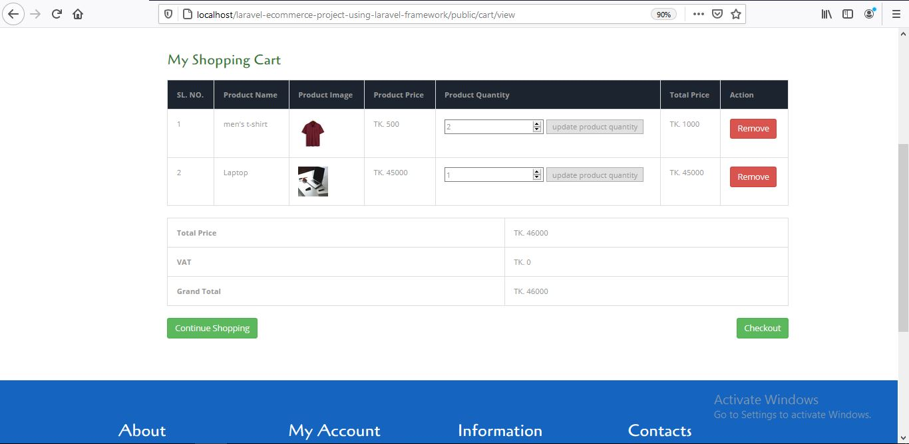

<h2>Laravel Ecommerce Project Using Laravel Framework</h2>
<h2>(Scroll down to see screenshots of different pages of the project)</h2>

This is an ecommerce application which is built with PHP Laravel framework. This application has two part. One is customer end part another is admin end part.

In the customer part customers can visit the application and buy products. In the home page New arrival products and also available products from different category are shown. In the menu bar there are available categories. When customers click on a specific category they can view products of that specific category. Customers can add product to the cart and also can remove product from the cart before confirm the order. To confirm the order, the customer must have to sign in. If they are not register yet, then they have to register to create an account.

In the admin end part there is a admin panel for the admins to control the application and its features. Admin can add category, manage category like publish or unpublish category, edit category, delete category, add new brand, manage brand, add product, manage product like view product details, publish or unpublish product, edit product, delete product, manage order like view order details, view order invoice, download order invoice as PDF, edit order, delete order, manage front end slider images etc.

This project is built with PHP Laravel framework which maintain MVC design pattern. Forms of this project is properly validated. Middleware are used to verify different requests. In this project I have used 3 packages and 1 plugin. Packages used in this project are : laravel collectives, intervention. io, dompdf.

  
<h3>Screenshots of different features and pages of this application given below.</h3>
<h3>Home page<h3>

<h3>home page scroll down 1<h3>

<h3>home page scroll down 2<h3>

<h3>Specific category page<h3>

<h3>Specific category page scroll down<h3>

<h3>Product details page<h3>

<h3>Cart<h3>

<h3>login and registration page<h3>

<h3>login and registration validation<h3>

<h3>Shipping page<h3>

<h3>Payment page<h3>

<h3>Complete order placement page<h3>

<h3>Admin login page<h3>

<h3>Admin deshboard<h3>

<h3>Add category<h3>

<h3>Manage category<h3>

<h3>Edit category<h3>

<h3>Add brand<h3>

<h3>Add product<h3>

<h3>Add product scroll down<h3>

<h3>Manage product<h3>

<h3>Edit product<h3>

<h3>Edit product scroll down<h3>

<h3>Manage order<h3>

<h3>View order details<h3>

<h3>view order details scroll down<h3>

<h3>View order invoice<h3>

<h3>Download order invoice as pdf<h3>

<h3>Manage slider<h3>

<h3>Admin logout<h3>

